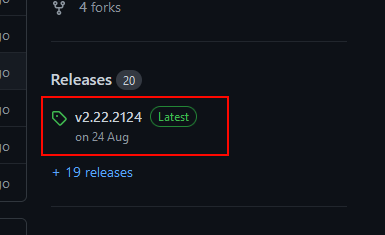
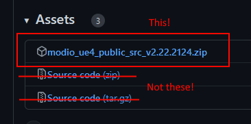

++++

++++

= mod.io Action RPG Demo

image:https://img.shields.io/discord/389039439487434752.svg?label=Discord&logo=discord&color=7289DA&labelColor=2C2F33[alt="Discord", link="https://discord.mod.io"]
image:https://img.shields.io/badge/docs-master-green.svg[alt="Master Docs", link="https://docs.mod.io/unreal/"]
image:https://img.shields.io/badge/Unreal-5.3%2B-green[alt="Unreal Engine", link="https://www.unrealengine.com"]

Welcome to the mod.io Action RPG demo repository. This project, originally created by Epic Games, demonstrates best practices for developing cross-platform games in Unreal Engine. It highlights features such as the Ability System, Gameplay Tags, and data-driven design, as well as common action RPG systems like character customization, inventory management, and combat mechanics.

== Engine & Platform Compatibility

This project already includes all the relevant mod.io plugins as submodules, so you do not need to install them separately. Support for this project is generally maintained to support the 3 most recent versions of Unreal Engine. 

However, the example UGC that has been uploaded to the game profile is only compatible with our lowest supported version of Unreal Engine. 

If you are using a different version, you will need to create your own UGC to be compatible with your version, and upload that to your own game profile.

=== Engine compatibility

|===
|Engine Version | Last Release
|UE5.3 | 2025.9
|UE5.4 | Current
|UE5.5 | Current
|UE5.6 | Current
|===

### Platform compatability

The project supports Windows, Linux, LinuxArm64, Mac, iOS and Android as part of the public release.

For access to Windows (GDK), XBox, Playstation 4, Playstation 5 or Switch, please https://docs.mod.io/support/contacts/[contact us].

== Features

* C++ and Blueprint support
* Integration of the mod.io Core plugin, mod.io Component UI plugin as well as the ModioUGC plugin.
* Examples of mod.io initialization, authentication, and user management
* Examples of using the Template UI, as well as a custom implementation using mod.io Component UI
* Examples of discovering and loading UGC packages at runtime, such as new weapons and maps
* Example game profile set up, including example UGC https://mod.io/g/action-rpg[can be found here].

== Documentation
Comprehensive documentation for this plugin https://docs.mod.io/unreal/modio-action-rpg[can be found here].

== Installation

=== Prerequisites

This project already includes all the relevant mod.io plugins as submodules. Ensure you are using a supported version of Unreal Engine, as listed in the Engine Compatibility section above. Using the minimum supported version to test against the example UGC provided in the game profile.

=== Getting the project
==== Cloning the repository

If you are using git, you can clone the repository with submodules included by running the following command:
[source,sh]
----
git clone --recurse-submodules https://github.com/modio/modio-ue-actionrpg.git
----

If you've already cloned the repository without submodules, you can initialize them with:

[source,sh]
----
git submodule update --init --recursive
----

==== In a non-git project, or without submodules

. Grab the latest release zip from the Releases section on this page, and extract it to a folder of your choice.

 

NOTE: The automatically generated zips on the release page and the 'Code' dropdown on this page will not work if this repository adds submodule dependencies in future releases. Please use the attached archive on the release instead. 

== Game studios and Publishers [[contact-us]]

If you need assistance with 1st party approvals, or require a private, white-label UGC solution. mailto:developers@mod.io[Contact us] to discuss.

== Contributions Welcome

Our Unreal Engine plugins are public and open source. Game developers are welcome to utilize them directly, to add support for mods in their games, or fork them for their games customized use. Want to make changes to our plugins? Submit a pull request with your recommended changes to be reviewed.

== Other Repositories

Our aim with https://mod.io[mod.io], is to provide an https://docs.mod.io[open modding API]. You are welcome to https://github.com/modio[view, fork and contribute to our other codebases] in use.

